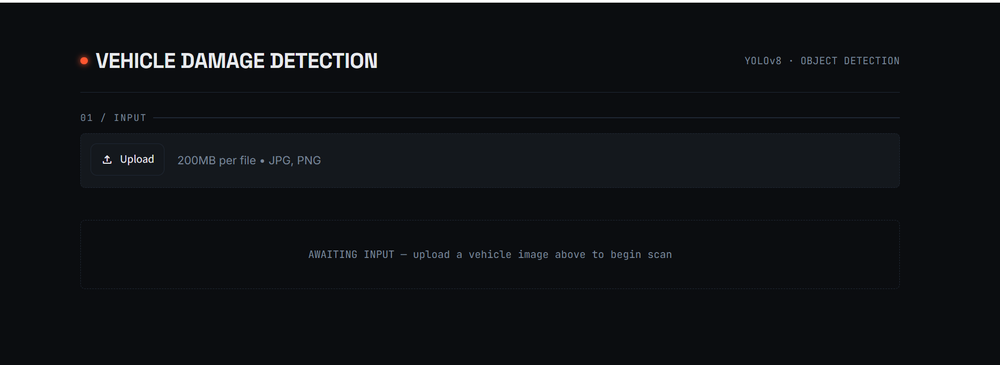

# 🚗 Vehicle Damage Detection

A computer vision web application that detects vehicle damage from uploaded images using a custom-trained YOLOv8 model. The application provides real-time damage detection, confidence scores, and annotated visual results through an interactive Streamlit interface.

## 🌐 Live Demo

**Try the application here:**

https://vehicle-damage-detection-cv.streamlit.app/

---

## Features

* Upload vehicle images for damage inspection
* Real-time damage detection using YOLOv8
* Automatic annotation of detected damage regions
* Confidence score reporting for each detection
* Modern and interactive Streamlit interface
* Fully deployed and accessible online

---

## Model Information

| Attribute    | Value                    |
| ------------ | ------------------------ |
| Architecture | YOLOv8                   |
| Framework    | Ultralytics              |
| Task         | Vehicle Damage Detection |
| Weights      | `best.pt`                |

---

## Screenshots

### Upload Interface



### Detection Results


### Detection Analytics


---

## Project Structure

```text
Vehicle-Damage-Detection/
│
├── app.py
├── requirements.txt
├── README.md
│
├── screenshots/
│   ├── home.png
│   ├── detection.png
│   └── analytics.png
│
└── models/
    └── best.pt
```

---

## Installation

### Clone the Repository

```bash
git clone https://github.com/ABDuR-ReHmAN013/Vehicle-Damage-Detection.git
cd Vehicle-Damage-Detection
```

### Install Dependencies

```bash
pip install -r requirements.txt
```

### Run the Application

```bash
streamlit run app.py
```

Open your browser and visit:

```text
http://localhost:8501
```

---

## Technologies Used

* Python
* Streamlit
* YOLOv8
* Ultralytics
* OpenCV
* Pillow

---

## Author

**Abdur Rehman**

Computer Science Student • Web Developer • Computer Vision Enthusiast

---

## License

This project is intended for educational, learning, and portfolio purposes.
